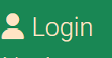
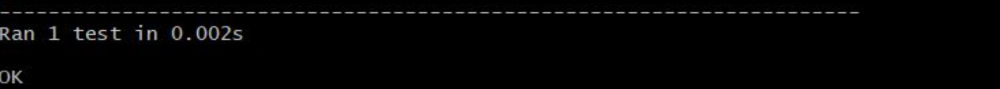

# Tasty-Trails

Yes, Tasty Trails. Your most delicious food feed! On our main site you can find starter, mains and dessert recipes. You can choose a recipe for tonight! You don't have to sign-up to view our recipes, but if you decide you want to share a recipe with us you can create an account and share your kitchen wonders!

We want to inspire people to take time in the kitchen to actually make good food. Food that feeds the soul.

** Picture of website
** Link to deployed version

This app is fully responsive on all devices. 

## Features

### Existing Features
- Food feed
  - This is the main page where the recipes are displayed. They are ordered in sets of three. With the buttons "PREV" and "NEXT" the user can scroll through these dishes.
  
- Recipe display
  - Whenever a user clicks on a recipe, there will open a new tab with the chosen recipe in full display. The new tab that opens is chosen so the user will not lose where they are in their navigating the recipes.
  
- Category browse
  - The user has the option to display only the Starters, Mains or Dessert by using the dropdown button in the navigation bar. This is important for the user to quickly navigate and find what they are looking for.
  
  
- Account actions
  - Sign-up
    - When the user is not logged in there will be a button on the front page to register. This button will take them to the Sign-up page. There is also a link available in the navigation bar to the sign-up page. Both of these links are not visible when logged in. It is very important to only display relevant information to the user.
    
    
    
  - Sign-in
    - There is a Login link in the top corner that can be used for logging in. When a user accidentally clicks on sign-up there is a link to sign-in.
    
    
  - Logout
    - When the User is logged in there will be a logout option in the right corner of the navigation bar.
    
  - Add recipe as User
    - When a User is logged in (and only then) there will be a link with "Add recipe". This link will take the user to a page with a form where they can leave a recipe.
    
    
- Admin Panel
  - CRUD
    - For someone with admin credentials there is the functionality of the admin panel. Create, Read, Update and Delete. Here recipes can be added. Content can be managed even deleted when it is deemed not fitting for the website.
    
  - Navigate
    - In the admin panel, content can be navigated through in a structured way. Recipes can be searched for by Category, Creation date, or Status.
    
    
 

### Future Features

- Download recipe
  - In the future it would be nice for the Site User to download the recipe to their computers so they can print this. We have already installed this with Javascript and the functionality itself worked. Only because the html pages are rendered with Jinja templating the page is not picked up on by the pfd transformer. This is something we will want to add for sure in the future.
- Comment/Like
  - For a Site User to leave comments and likes on the recipes would be a must in the future. This way we can build a platform where people can engage and this will help us build a community. A cooking family.
- Safe recipes
  - In the future the account pages will be more elaborate. This way a Site User can create a personal file where recipes can be saved to either display later, or even added recipes be edited later.

## Agile Development

This project was made according to the Agile development structure. This means the following steps were taken before and during the development process:
- Planning ahead with a vision board
** Picture of board
- User stories
  - User stories were written and categorized. During the development process they were picked up one by one resulting in 9 closed User Stories.

## Testing
 
While in development and after this project has been extensively tested.

### Validation Testing

- HTML
  - Due to working with Jinja Templating it is not possible to let the URL be checked by the regular HTML validator from W3C. However the HTML code has been thoroughly checked to see if the formatting, indenting and overall structure is correct. The outcome is positive
- CSS
  - The custom CSS file apart from the bootstrap styling has been tested through W3C. The result is visible in the picture, again positive.
- Python
  - The written Python code has been tested with the PEP8 linter on the local server. Documentation on each specific file is visible in the pictures.

    - models.py while testing; 
    
    - models.py after correcting;
    
    - test_models.py while testing;
    
    - test_models.py after testing; 
    
    - url.py while testing; 
    
    - url.py after testing; 
    
    - views.py while testing; 
    
    - views.py after testing; 
    
    - settings.py while testing;
    
    - settings.py after testing; 
    
    - urls.py
    

### Django Built-in Testing

- Using UnitTest
  - While coding UnitTest is used. There was a problem however with accessing the database as I have used a remote database for this project, ElephantSQL. While in testing mode I had to switch to the Django provide SQLite to be able to run my test_*.py files. Only to then work with an empty database as SQLite which was not used for my project. This has led to only keeping 1 working test file in my deployed version. Whenever it is wanted to run this test file the following line need to be added to env.py;
  os.environ['DEVELOPMENT'] = "True"
 

### Manual Testing

- Friends/ Mentor/ Personally

### Unfixed Bugs

- PEP8 Warnings
  - Two warnings keep remaining when running the PEP8 linter.
  1. Blank line on the end of the page.
  2. Line too long
  The blank line is not visible as can be seen on the picture. When the lines of code that were indicated to be too long, where dived over 2 lines another warning would show up. The warnings are visible in the picture, either over-indented or under-indented.

  Therefore is decided to leave the warnings as the are.

- Image upload
  - As a user you can add a recipe. By default the placeholder image is connected to this recipe, it is in the current construction not possible to upload a chosen image. This could be possible through rendering each input field on itself so custom code can be written to handle image uploading. Due to the form validation which works seemingless with the database now, this is not implemented.

## Deployment

- This app is deployed on Heroku.
  - First the code was written in gitpod and pushed to Github in a respiratory called Tasty Trails.
  - Tasty Trails repository is connected to Heroku.
  - The branch is deployed on the Heroku platform.
  [LinkToApp](https://tastytrails.herokuapp.com/)

## Credits

### Code
- Code institute blog project
  - This project helped me form the idea for my own project.

### Content
- Code Institute
  - This school has taught me all the basics of coding. Has helped me form an idea on what project to build in Django and through very well documented resources have guided me through the process of development.
- Word Wide Web Search Inspirations for recipes
  - By searching through many sites and blogs, I have managed to create a collection of delicious recipes.

### Media

- Istock foto's
- Open source imagery

### Tutors

- Mentor
  -
- Code Institutes video material

